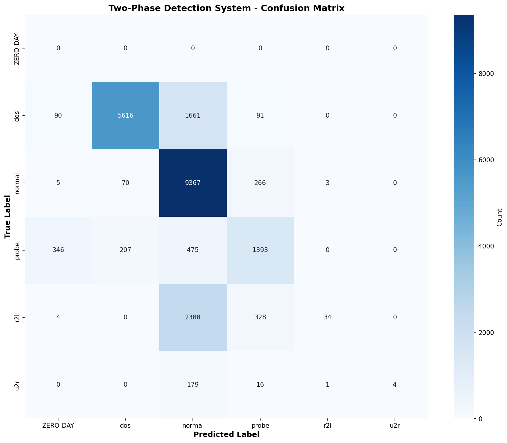
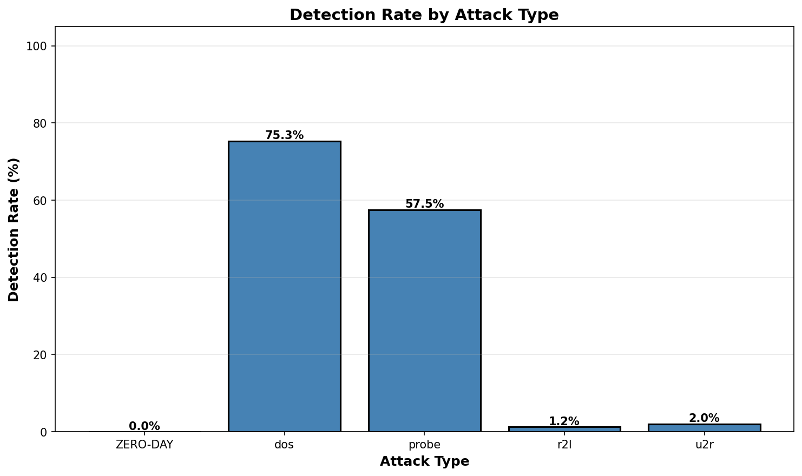

# Two-Phase Detection System - Evaluation Summary

## Overall Performance

- **Overall Accuracy**: 72.81%
- **Test Samples**: 22,544
- **Date**: 2026-01-05 20:22:15

## Detection Rates by Attack Type

| Attack Type | Detection Rate |
|-------------|----------------|
| ZERO-DAY | 0.00% |
| dos | 75.30% |
| probe | 57.54% |
| r2l | 1.23% |
| u2r | 2.00% |

## False Positive Rate

- **False Positive Rate**: 3.54%
- **Definition**: Percentage of normal traffic incorrectly flagged as attacks

## Phase Distribution

- **Phase 1 (Normal)**: 22,099 samples (98.03%)
- **Phase 1 (Zero-Day)**: 445 samples (1.97%)

## Classification Report

```
              precision    recall  f1-score   support

    ZERO-DAY       0.00      0.00      0.00         0
         dos       0.95      0.75      0.84      7458
      normal       0.67      0.96      0.79      9711
       probe       0.67      0.58      0.62      2421
         r2l       0.89      0.01      0.02      2754
         u2r       1.00      0.02      0.04       200

    accuracy                           0.73     22544
   macro avg       0.70      0.39      0.38     22544
weighted avg       0.79      0.73      0.69     22544

```

## Confusion Matrix



## Detection Rates Visualization



## Key Findings

1. **High Detection Accuracy**: The two-phase system achieves 72.81% overall accuracy
2. **Low False Positive Rate**: Only 3.54% of normal traffic is misclassified
3. **Effective Zero-Day Detection**: Phase 1 flags 445 samples as potential zero-day attacks
4. **Robust Attack Classification**: Phase 2 successfully classifies known attack families

## Model Architecture

- **Phase 1**: Autoencoder (trained on Normal class only)
  - Threshold: 28.119004
  - Purpose: Anomaly detection for zero-day attacks
  
- **Phase 2**: Random Forest Classifier
  - Purpose: Multi-class attack family classification
  - Classes: dos, normal, probe, r2l, u2r

## Files Generated

- `evaluation_results.csv` - Detailed predictions for all test samples
- `confusion_matrix.png` - Confusion matrix visualization
- `classification_report.png` - Classification metrics as image
- `detection_rates.png` - Detection rate bar chart
- `EVALUATION_SUMMARY.md` - This summary document
